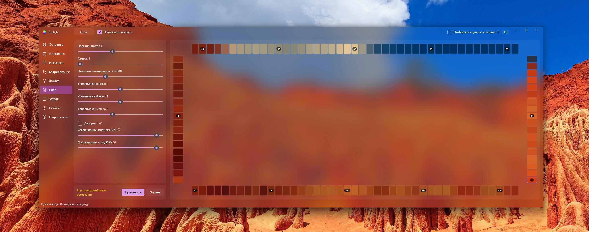

# Rimlight

Фоновая подсветка монитора для Windows. Программа захватывает изображение экрана,
усредняет цвет по зонам вдоль краёв и отправляет результат на адресную светодиодную ленту
через COM-порт по протоколу Adalight. Этот протокол поддерживают распространённые прошивки
для Arduino.

*[English version below](#rimlight-english)*



Железная часть и сама идея взяты из проекта AlexGyver
[Arduino_Ambilight](https://github.com/AlexGyver/Arduino_Ambilight). Rimlight заменяет
только программу на компьютере и работает с той же прошивкой без изменений.

Написан на замену [Prismatik](https://github.com/psieg/Lightpack) — ради скорости и
гибкости захвата изображения.

## Как это работает

**Резервные методы захвата.** Основной метод — Desktop Duplication. Если он перестаёт
выдавать кадры, источник переключается на Windows Graphics Capture, затем на GDI, и
возвращается к предыдущему, когда тот снова выдаёт кадры. Текущий источник показан в
строке состояния.

**Различение простоя и сбоя.** Неподвижный экран не производит новых кадров, и это
нормальная ситуация, не требующая переключения. Логика разделяет два случая: кадров нет,
потому что изображение не меняется, и кадров нет, потому что метод перестал работать. В
неоднозначных случаях выполняется контрольный снимок через GDI.

**Обработка кадра на видеокарте.** Кадр уменьшается аппаратной генерацией мип-уровней,
результат читается через кольцо промежуточных буферов без блокировки: по шине передаётся
около 4 КБ на кадр вместо 20 МБ, а чтение не ожидает освобождения видеокарты.

**Расчёт цвета в линейном пространстве.** Усреднение, баланс белого, насыщенность и
сглаживание выполняются над линейными значениями, гамма-коррекция применяется в конце.
Без этого усреднение занижает яркость на контрастных сценах.

**Адаптивное кадрирование.** Фильм шире экрана идёт с чёрными полосами сверху и снизу, и
диоды вдоль них не светят. Границы картинки определяются по кадру, и зоны выборки
переносятся внутрь неё; картинка при этом может раскладываться по всей ленте, чтобы на ней
не оставалось тёмных участков. Субтитры и панель плеера рисуются поверх полосы, поэтому
строка проверяется по краям, отдельно от центра, а короткий светлый участок внутри полосы
границей не считается. Новые границы применяются, только если продержались заданное время,
иначе за полосу принималась бы тёмная сцена.

## Что нужно

- Windows 10 2004 или новее (лучше Windows 11)
- [.NET 9 Desktop Runtime](https://dotnet.microsoft.com/download/dotnet/9.0)
- Контроллер ленты на COM-порту с прошивкой, поддерживающей Adalight — например Arduino с
  [Gyver_Ambilight](https://github.com/AlexGyver/Arduino_Ambilight). Прошивка в этот
  репозиторий не входит.

Формат кадра на проводе — стоковый Adalight:

```
'A' 'd' 'a'  hi  lo  chk        chk = hi ^ lo ^ 0x55,  hi/lo кодируют (N - 1)
далее N x (R, G, B)
```

На скорости 1 Мбод кадр для 122 диодов занимает 372 байта, то есть 3,7 мс на проводе;
вместе с 3,7 мс на защёлкивание ленты это даёт максимум около 135 кадров в секунду —
больше, чем выдаёт захват.

## Сборка

```bash
dotnet build src/Rimlight/Rimlight.csproj -c Release
```

Сборка в один файл:

```bash
dotnet publish src/Rimlight -c Release -r win-x64 --self-contained false -p:PublishSingleFile=true -o dist
```

Для машины без установленного рантайма .NET добавить `--self-contained true`.

## Настройка

1. **Устройство** — выбрать монитор и COM-порт, нажать «Применить и переподключиться».
   Монитор запоминается по модели из EDID, поэтому перестановка кабеля между разъёмами
   видеокарты не переводит захват на другой экран.
2. **Раскладка** — задать число диодов по сторонам, стартовый угол и направление. Кнопка
   **«Показать схему на экране»** накладывает пронумерованные зоны выборки поверх экрана;
   клик по ячейке подсвечивает её зелёным. Схема попадает в захват как обычное
   изображение, поэтому зелёный диод на ленте подтверждает сразу геометрию, нумерацию и
   цветопередачу.
3. Точная подгонка выполняется ползунком **«Смещение»**: стартовый угол сам по себе не
   определяет положение первого диода — оно зависит ещё и от того, по какой стороне лента
   уходит из угла.
4. **Яркость** — общий предел яркости и три настройки тёмного конца кадра.
   **«Порог темноты»** гасит зоны ниже заданного уровня, **«Обесцвечивание тёмного»**
   убирает с них оттенок баланса белого — без него чёрная полоса плеера при тёплом
   балансе светит тёмно-красным, — а **«Минимальная подсветка»** не даёт ленте гаснуть
   на чёрном кадре.
5. **Цвет** — температура и усиления по каналам подбираются под цвет стены за монитором.
6. **Кадрирование** — включает поиск чёрных полос, по умолчанию выключенный. Значения
   рассчитаны на фильмы 2.35:1 и 21:9. Если полосы теряются при всплывающей панели плеера,
   увеличивается **«Пропускать помехи»**; если кадрирование срабатывает на тёмных сценах —
   **«Задержка подтверждения»** и **«Минимальная полоса»**.
7. **Захват** — ползунок **«Максимум кадров в секунду»** задаёт, как часто кадр экрана
   сводится к цветам зон и уходит на ленту. Кадр, пришедший раньше этого срока,
   отбрасывается, поэтому ограничение добавляет к задержке вывода до одного своего
   периода: замер камерой на 240 кадров в секунду даёт около 30 мс от смены цвета на
   экране до смены на ленте при пределе 60 и 10–20 мс в положении **«без ограничения»**,
   которое стоит по умолчанию. Без ограничения частота упирается в период контроллера —
   около 7 мс на 122 диода при 1 Мбод. Ограничение уменьшает число сводов кадра на
   видеокарте, так что на слабой карте или в тяжёлой игре оно может оказаться полезным.
8. **Питание** — ползунок **«Предел тока»** ограничивает ток всей ленты. Срабатывает
   только на светлых кадрах, поэтому на цветных сценах разницы обычно не видно.
   Выставляется по блоку питания: 120 диодов WS2812 на полном белом берут около 7 А.

Кнопка **«По умолчанию»** в разделе «Основное» возвращает настройки к стандартным, не
трогая выбор монитора и порта, раскладку ленты, язык и положение окна.

Галка **«Проверять обновления при запуске»** в разделе «О программе» по умолчанию
выключена: это единственное обращение программы в сеть, и наружу уходит только номер
текущей версии.

Для проверки на настоящем кадре в `pics/Rainbow.jpg` лежит изображение с насыщенными
цветами во всех частях кадра. Установленное фоном рабочего стола, оно показывает
раскладку целиком: каждый участок ленты должен повторять цвет ближайшего к нему края
экрана.

Суммарное число диодов должно совпадать с `NUM_LEDS` в прошивке: стоковые скетчи Adalight
читают фиксированное число байт независимо от заголовка, поэтому при расхождении
изображение смещается вдоль ленты.

Настройки, лог и файлы переводов хранятся в `%APPDATA%\Rimlight\`.

## Локализация

В программу встроены два языка, русский и английский. При первом запуске они
записываются в `%APPDATA%\Rimlight\lang\` как `ru.json` и `en.json`, дальше читаются
именно эти файлы: правка в файле видна после перезапуска. При обновлении программы оба
встроенных файла перезаписываются, чтобы старый файл не скрыл новые формулировки;
признак этого — поле `_version`. Добавленные языки остаются как есть.

Свой перевод — это ещё один файл в той же папке:

1. Скопировать `en.json` под именем с кодом языка, например `de.json`: имя файла и есть
   код языка. Шаблоны обоих встроенных языков лежат в папке [lang](lang) репозитория.
2. Заменить значения на переведённые, ключи слева оставить как есть. `{0}` внутри
   строки — подстановка (версия, путь, число диодов), её нужно сохранить. В поле `_name`
   пишется название языка так, как оно должно выглядеть в списке, например `Deutsch`.
   Поле `_version` можно удалить: оно относится только к встроенным файлам.
3. Запустить программу — язык появится в списке в разделе «Основное».

Файл проверяется только на базовую структуру: он должен читаться как JSON вида
«строка: строка» и содержать хотя бы несколько знакомых ключей, иначе он не считается
переводом и пропускается с записью в лог. Переводить всё сразу не обязательно:
пропущенные ключи берутся из английского. У добавленного языка часть служебного текста
тоже остаётся английской — сообщения лога и подписи в статистике заданы в коде, а не в
JSON.

## Захват под нагрузкой GPU

Desktop Duplication и Windows Graphics Capture читают результат работы композитора
Windows (DWM). Композиция выполняется на видеокарте, и при полной загрузке GPU игрой
композитору может не хватать времени на выполнение. В этом случае оба метода перестают
выдавать кадры, при этом ошибок не возникает. Это проявляется как рост p99 интервала
между кадрами и частые переключения на GDI в строке состояния.

На частоту композиции влияют два фактора:

- **Планирование GPU с аппаратным ускорением** (Параметры → Система → Дисплей → Графика →
  Настройки графики по умолчанию). При включённой настройке распределением задач
  занимается видеокарта, и задачи композитора конкурируют с кадрами игры на общих
  основаниях. При выключенной распределением занимается планировщик Windows, который
  выделяет им время чаще. Измерение на одной конфигурации (RTX 4080, 3440×1440, 165 Гц):
  при выключенной настройке захват сохраняет стабильность при загрузке GPU 97–98%.
  Генерация кадров DLSS требует включённой настройки, поэтому такой вариант доступен не
  всегда.
- **Запас по загрузке GPU.** Ограничение частоты кадров игры ниже фактически достижимой
  оставляет композитору время независимо от планировщика.

## Структура репозитория

```
src/Rimlight        приложение: раскладка, цвет, COM-порт, интерфейс
src/Rimlight.Core   бэкенды захвата, конвейер цвета, шина кадров, локализация
tools/CaptureProbe  диагностика: все методы захвата рядом, с замерами
tools/LatencyProbe  замер задержки «экран → лента» камерой на 240 к/с
lang                шаблоны переводов, они же пишутся в %APPDATA%
```

`tools/CaptureProbe` запускает все бэкенды захвата одновременно на одном мониторе и
показывает частоту кадров, перцентили интервалов, стоимость кадра по стадиям и
посекундную историю. Результаты измерений собраны в его README.

`tools/LatencyProbe` выводит на экран ту же сетку зон, что читает движок, и раз в
несколько секунд перекрашивает её в очередной базовый цвет, показывая рядом таймер до
миллисекунд. Съёмка экрана и ленты одним кадром на 240 к/с даёт сквозную задержку
снаружи — вместе с прошивкой и матрицей, там где внутренняя статистика заканчивается на
записи в порт.

## Шина кадров

Если включена опция «Отдавать кадры», уменьшенные кадры публикуются в разделяемую память:
второй процесс может использовать тот же захват для другой подсветки, не открывая
собственный. Формат описан в `src/Rimlight.Core/Frames/FrameBus.cs`.

Имя разделяемой памяти оставлено прежним — `Local\AmbilightFrameBus`. Его использует
существующий потребитель, и переименование нарушило бы совместимость.

## Благодарности

- [AlexGyver / Arduino_Ambilight](https://github.com/AlexGyver/Arduino_Ambilight) —
  конструкция железа, прошивка и сама идея.
- [psieg / Lightpack (Prismatik)](https://github.com/psieg/Lightpack) — предшественник;
  его код захвата помог разобраться в части описанных здесь проблем.
- [Vortice.Windows](https://github.com/amerkoleci/Vortice.Windows) — привязки Direct3D 11
  и DXGI для .NET.
- [Spout2](https://github.com/leadedge/Spout2) — обмен текстурами; используется одним из
  экспериментальных бэкендов в CaptureProbe.

## Лицензия

MIT — см. [LICENSE](LICENSE).

---

<a name="rimlight-english"></a>

# Rimlight (English)

Screen-driven ambient lighting for Windows. The program captures the screen, averages
colours over zones along the edges and sends the result to an addressable LED strip over a
serial port using the Adalight protocol. The protocol is supported by common Arduino
firmware.


The hardware side and the original idea come from AlexGyver's
[Arduino_Ambilight](https://github.com/AlexGyver/Arduino_Ambilight). Rimlight replaces only
the PC program and works with the same firmware unchanged.

Written as a replacement for [Prismatik](https://github.com/psieg/Lightpack), aiming at
faster and more flexible screen capture.

## How it works

**Fallback capture methods.** Desktop Duplication is the primary method. If it stops
delivering frames, the source switches to Windows Graphics Capture and then to GDI, and
returns to the previous method once that one delivers frames again. The current source is
shown in the status area.

**Distinguishing idle from failure.** A still screen produces no new frames, which is
normal and does not require switching. The logic separates two cases: no frames because
the image is not changing, and no frames because the method stopped working. Ambiguous
cases are resolved with a GDI probe.

**Frame processing on the GPU.** Frames are downscaled with hardware mip generation and
read back through a non-blocking ring of staging buffers: about 4 KB per frame crosses the
bus instead of 20 MB, and the readback does not wait for the GPU to become free.

**Colour maths in linear space.** Averaging, white balance, saturation and smoothing are
done on linear values; gamma encoding is applied at the end. Without this, averaging
understates brightness on high-contrast scenes.

**Adaptive cropping.** Material wider than the screen comes with black bars above and below
it, and the LEDs along them do not light. The edges of the picture are found in the frame
and the sampling zones move inside them; the picture can be spread across the whole strip
so that no part of it is left dark. Subtitles and player controls are drawn over the bar, so
each row is judged by its ends rather than its middle, and a short lit run inside the bar is
not taken for an edge. New edges are acted on only after they have held for a set time, or a
dark scene would be read as a bar.

## Requirements

- Windows 10 2004 or newer (Windows 11 recommended)
- [.NET 9 Desktop Runtime](https://dotnet.microsoft.com/download/dotnet/9.0)
- An Adalight-compatible LED controller on a serial port — for example an Arduino running
  [Gyver_Ambilight](https://github.com/AlexGyver/Arduino_Ambilight). The firmware is not
  part of this repository.

The frame format on the wire is stock Adalight:

```
'A' 'd' 'a'  hi  lo  chk        chk = hi ^ lo ^ 0x55,  hi/lo encode (N - 1)
then N x (R, G, B)
```

At 1 Mbaud a 122-LED frame takes 372 bytes, that is 3.7 ms on the wire; together with
another 3.7 ms to latch into the strip that allows up to about 135 frames per second —
more than capture produces.

## Building

```bash
dotnet build src/Rimlight/Rimlight.csproj -c Release
```

A single-file build:

```bash
dotnet publish src/Rimlight -c Release -r win-x64 --self-contained false -p:PublishSingleFile=true -o dist
```

Add `--self-contained true` for a machine without the .NET runtime installed.

## Setup

1. **Device** — pick the monitor and the serial port, press *Apply and reconnect*. The
   monitor is remembered by its EDID model, so moving a cable between ports of the
   graphics card does not point the capture at a different screen.
2. **Layout** — enter the LED count per side, the start corner and the direction. The
   *Show map on screen* button overlays numbered sampling zones on the screen; clicking a
   cell highlights it in green. The map is captured like any other image, so a green LED on
   the strip confirms the geometry, the numbering and the colour path at once.
3. Fine-tuning is done with the **Offset** slider: the start corner alone does not
   determine the position of the first LED — it also depends on which side the strip leaves
   the corner on.
4. **Brightness** — the overall brightness limit and three settings for the dark end of
   the frame. **Darkness threshold** puts out zones below a given level, **Shadow
   desaturation** removes the white balance tint from them - without it a black player bar
   lights the strip dark red under a warm balance - and **Minimum backlight** keeps the
   strip from going out on a black frame.
5. **Colour** — temperature and the per-channel gains are matched to the wall behind the
   monitor.
6. **Cropping** — switches on the search for black bars, which is off by default. The
   values suit 2.35:1 and 21:9 films. If the bars are lost when the player controls appear,
   raise **Step over interference**; if the crop reacts to dark scenes, raise **Confirmation
   delay** and **Smallest bar**.
7. **Capture** — the **Maximum frames per second** slider sets how often a screen frame
   is reduced to zone colours and sent to the strip. A frame arriving inside that window is
   dropped, so a limit adds up to one of its own periods to the output delay: measured with
   a camera at 240 fps, a change takes about 30 ms to reach the strip with the limit at 60
   and 10-20 ms at **no limit**, which is the default. With no limit the rate meets the
   controller's own period instead - about 7 ms for 122 LEDs at 1 Mbaud. A limit cuts the
   number of frame reductions done on the graphics card, which can be worth having on a
   weak card or in a demanding game.
8. **Power** — the **Current ceiling** slider caps the current the whole strip draws. It
   only engages on bright frames, so coloured scenes usually show no difference. Set it by
   the supply: 120 WS2812 at full white draw about 7 A.

The **Defaults** button in the General section puts the settings back to their standard
values, leaving the chosen monitor and port, the strip layout, the language and the window
position alone.

The **Check for updates at startup** box in the About section is off by default: it is the
only request the program makes outside the machine, and the only thing sent out is the
current version number.

For a check against a real frame, `pics/Rainbow.jpg` is an image with saturated colours
in every part of the frame. Set as the desktop background, it shows the whole layout at
once: every part of the strip should repeat the colour of the screen edge nearest to it.

The LED total must match `NUM_LEDS` in the firmware: stock Adalight sketches read a fixed
number of bytes regardless of the header, so a mismatch shifts the picture along the strip.

Settings, the log and translation files are stored in `%APPDATA%\Rimlight\`.

## Localisation

Two languages are built into the program, Russian and English. On the first run they are
written to `%APPDATA%\Rimlight\lang\` as `ru.json` and `en.json`, and those files are
what gets read from then on, so an edit to a file takes effect on the next start. An
update of the program rewrites both built-in files so that an old file cannot hide the
new wording; the `_version` entry is what marks it. Added languages are left as they are.

A translation of your own is one more file in the same folder:

1. Copy `en.json` to a name holding the language code, `de.json` for instance: the file
   name is the language code. Templates of both built-in languages are in the
   [lang](lang) folder of the repository.
2. Replace the values with the translated text and leave the keys on the left as they
   are. A `{0}` inside a string is a substitution (a version, a path, an LED count) and
   has to be kept. The `_name` entry is the language as it should appear in the list,
   `Deutsch` for instance. The `_version` entry can be deleted: it concerns the built-in
   files only.
3. Start the program — the language appears in the list in the *General* section.

Only the basic structure is checked: the file has to read as a JSON map of string to
string and to hold at least a few known keys, otherwise it is not taken for a translation
and is skipped with a line in the log. There is no need to translate everything at once:
the keys left out are taken from English. An added language also keeps part of the
incidental text in English — log messages and the words in the statistics line are
written in the code rather than in the JSON.

## Capture under GPU load

Desktop Duplication and Windows Graphics Capture both read the output of the Windows
compositor (DWM). Composition runs on the GPU, and when a game fully loads the GPU the
compositor may not get enough time to run. Both methods then stop delivering frames, and
no error is reported. This appears as a growing p99 frame interval and frequent switches
to GDI in the status area.

Two factors affect how often composition runs:

- **Hardware-accelerated GPU scheduling** (Settings → System → Display → Graphics →
  Default graphics settings). With the setting enabled, work scheduling is handled by the
  GPU, and compositor tasks compete with game frames on equal terms. With it disabled,
  scheduling is handled by Windows, which allocates time to them more often. Measured on
  one configuration (RTX 4080, 3440×1440, 165 Hz): with the setting disabled, capture
  remains stable at 97–98% GPU load. DLSS Frame Generation requires the setting enabled,
  so this option is not always available.
- **GPU headroom.** Capping the game's frame rate below the rate the GPU can sustain
  leaves time for the compositor regardless of the scheduler.

## Repository layout

```
src/Rimlight        the application: layout, colour, serial, UI
src/Rimlight.Core   capture backends, colour pipeline, frame bus, localisation
tools/CaptureProbe  diagnostic tool: every capture method side by side, with metrics
tools/LatencyProbe  screen-to-strip latency, measured with a 240 fps phone camera
lang                translation templates, also written to %APPDATA%
```

`tools/CaptureProbe` runs all capture backends at once on a single monitor and reports
frame rate, interval percentiles, per-stage frame cost and a second-by-second history. The
measurement results are collected in its README.

`tools/LatencyProbe` puts the engine's own zone grid on screen, repaints it in a primary
colour every few seconds and runs a millisecond clock beside it. Filming the screen and
the strip in one shot at 240 fps gives the end-to-end latency from outside - firmware and
panel included, where the built-in statistics stop at the serial write.

## Frame bus

With the *Publish frames* option enabled, the reduced frames are published to shared
memory: a second process can drive other lighting from the same capture without opening its
own. The format is described in `src/Rimlight.Core/Frames/FrameBus.cs`.

The shared-memory name is kept as `Local\AmbilightFrameBus`. An existing consumer uses it,
and renaming it would break compatibility.

## Credits

- [AlexGyver / Arduino_Ambilight](https://github.com/AlexGyver/Arduino_Ambilight) — the
  hardware build, the firmware and the original idea.
- [psieg / Lightpack (Prismatik)](https://github.com/psieg/Lightpack) — the predecessor;
  its capture code helped in understanding some of the problems described here.
- [Vortice.Windows](https://github.com/amerkoleci/Vortice.Windows) — Direct3D 11 and DXGI
  bindings for .NET.
- [Spout2](https://github.com/leadedge/Spout2) — texture sharing; used by one of the
  experimental capture backends in CaptureProbe.

## Licence

MIT — see [LICENSE](LICENSE).
